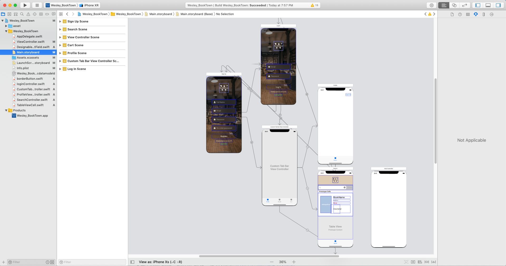

# bookstore_ios_frontend

Using Xcode with Swift to develop the front end side. Online Bookstore which is a good platform to buy books. The feature includes sign up/ log in/ show all books in tableview/ search book/ Cart's basic features.
Furthermore, app covers security. the user will get the JWT token from the server after logging in and it will be authorized every time when user sent the http request to the server each time after user log in.

### Prerequisites

Install Xcode

For mac [xcode](https://itunes.apple.com/us/app/xcode/id497799835?mt=12)

For Window , it is not free [Plan](https://portal.macincloud.com/select/#/plans), 
[macincloud](https://www.macincloud.com/)

## Features
1.Log in
2.Sign up
3.Show the book in tableview
4.Cart

## Running the tests

Open the Xcode and download the simulator. This app is going to sent http request to the server. Thus, user must clone the [bookstore_ios_backend](https://github.com/Wesley16838/bookstore_ios_backend) and run npm start on the localhost:3000

## Authors

* *Wei-Hsuan Wong* - *Initial work* - [Wesley16838](https://github.com/Wesley16838)

